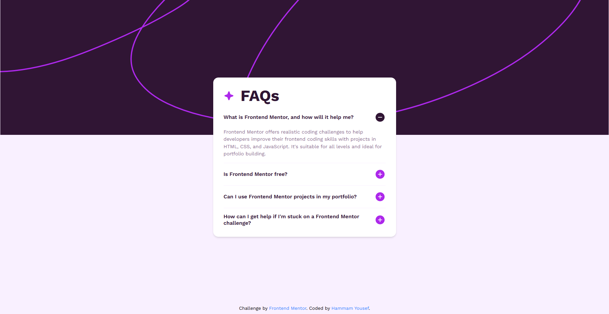

# Frontend Mentor - FAQ accordion solution

This is a solution to the [FAQ accordion challenge on Frontend Mentor](https://www.frontendmentor.io/challenges/faq-accordion-wyfFdeBwBz). Frontend Mentor challenges help you improve your coding skills by building realistic projects.

## Table of contents

- [Overview](#overview)
  - [The challenge](#the-challenge)
  - [Screenshot](#screenshot)
  - [Links](#links)
- [My process](#my-process)
  - [Built with](#built-with)
  - [What I learned](#what-i-learned)
  - [Continued development](#continued-development)
  - [Useful resources](#useful-resources)
- [Author](#author)
- [Acknowledgments](#acknowledgments)

## Overview

### The challenge

Users should be able to:

- Hide/Show the answer to a question when the question is clicked.
- Navigate the questions and hide/show answers using keyboard navigation alone.
- View the optimal layout for the interface depending on their device's screen size.
- See hover and focus states for all interactive elements on the page.
- Experience smooth animations when expanding or collapsing the FAQ sections.
- Benefit from accessible features such as ARIA attributes for screen readers.

### Screenshot



### Links

- Solution URL: [Add solution URL here](https://your-solution-url.com)
- Live Site URL: [Add live site URL here](https://your-live-site-url.com)

## My process

### Built with

- Semantic HTML5 markup
- CSS custom properties
- Flexbox
- Mobile-first workflow
- [React](https://reactjs.org/) - JS library
- [GSAP](https://greensock.com/gsap/) - For animations
- Accessibility features (ARIA attributes)

### What I learned

This project helped me improve my understanding of:

- Implementing smooth animations using GSAP.
- Enhancing accessibility with ARIA attributes like `aria-expanded`, `aria-controls`, and `aria-hidden`.
- Structuring React components for reusability (`FAQ_Card` and `FAQ_Collapse`).
- Managing state in React to control UI behavior.

Here’s an example of how I used GSAP for smooth animations:

```tsx
useGSAP(() => {
  if (!faqContentRef.current) return;
  const contentHeight = faqContentRef.current.scrollHeight;
  if (isOpen) {
    gsap.to(faqContentRef.current, {
      height: contentHeight,
      duration: 0.25,
      ease: "power3.inOut",
      onStart: () => {
        faqContentRef.current!.style.overflow = "hidden";
      },
      onComplete: () => {
        faqContentRef.current!.style.overflow = "visible";
      },
    });
  } else {
    gsap.to(faqContentRef.current, {
      height: 0,
      duration: 0.25,
      ease: "power3.inOut",
      onStart: () => {
        faqContentRef.current!.style.overflow = "hidden";
      },
    });
  }
}, [isOpen]);
```

### Continued development

In future projects, I want to:

- Explore more advanced animation techniques with GSAP.
- Further improve accessibility by testing with screen readers.
- Implement unit tests for components to ensure reliability.

### Useful resources

- [GSAP Documentation](https://greensock.com/docs/) - Helped me understand how to implement animations effectively.
- [MDN Web Docs: ARIA](https://developer.mozilla.org/en-US/docs/Web/Accessibility/ARIA) - Provided guidance on making the FAQ accessible.

## Author

- Website - [Hammam Yousef - Portfolio](https://portfolio-chi-livid-76.vercel.app/)
- Frontend Mentor - [@HammamYousef](https://www.frontendmentor.io/profile/HammamYousef)

## Acknowledgments

Thanks to the Frontend Mentor community for providing feedback and support during this challenge.
